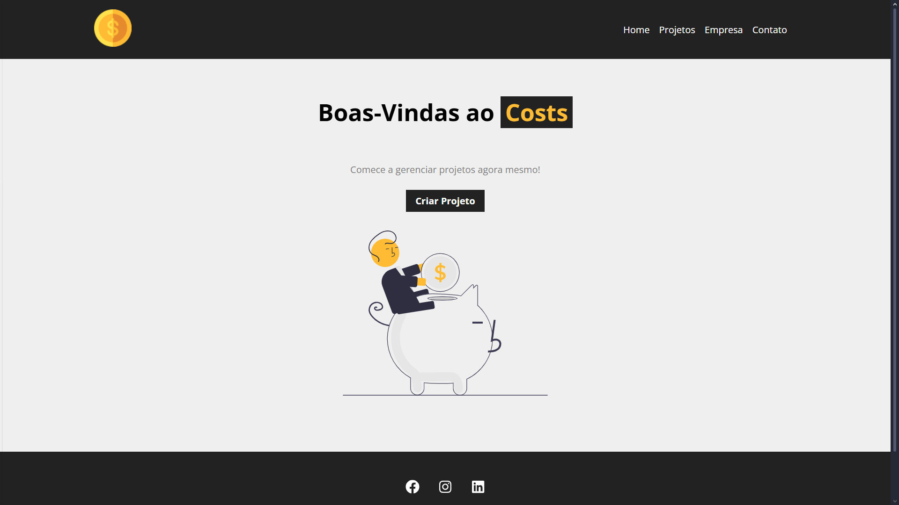

# 💲 Costs

 Projeto desenvolvido com o youtuber [Matheus Battisti](https://www.youtube.com/@MatheusBattisti) em seu curso de [React JS](https://youtube.com/playlist?list=PLnDvRpP8BneyVA0SZ2okm-QBojomniQVO&si=mP84Itow-4nrXjpK) gratuito no youtube. Utiliza-se a criação e o gerenciamento de projetos como conteúdo principal do site.


## 🌐 Aplicação Hospedada

 [Clique aqui para acessar o website](https://costs-nu-ten.vercel.app/)


## 🎞️ Pré-visualização

 


## ⚡ Funcionalidades

 - Criar e gerenciar projetos
 - Validação de campos de preenchimento
 - Menu horizontal de navegação por páginas


## 🚀 Tecnologias Utilizadas

 <p align="left">
   
   
   
   
   
   
 </p>


## 📂 Estrutura do Projeto

 ```plaintext
 costs/
 ├── node_modules/       # Dependências
 ├── public/             # Arquivos principais
 │   ├── logo.png        # Logo do website
 │   ├── index.html      # Arquivo principal de renderização
 │   ├── manifest.json      
 │   ├── preview.png   
 │   ├── robots.txt
 ├── src/                # Código de fonte da aplicação
 │   ├── components/     # Componentes reutilizáveis (header, footer, etc)
 │   ├── img/            # Imagens utilizadas
 │   ├── App.js          # Componente principal de renderização
 │   ├── index.css       # Arquivo principal de CSS
 |   ├── main.js
 ├── .gitattributes
 ├── .gitignore
 ├── db.json             # Arquivo de banco de dados simulado
 ├── LICENSE             # Arquivo de licença do projeto
 ├── package-lock.json
 ├── package-json
 ├── README.md
 ```


## 💾 Instalação dos Recursos Necessários

 Dependências básicas do React Next
 
 ```bash
   npm i
 ``` 

 React Icons
 
 ```bash
   npm i react-icons
 ```

 React Router Dom
 
 ```bash
   npm i react-router-dom
 ```

 Json Server
 
 ```bash
   npm i json-server
 ```

 UUID
 
 ```bash
   npm i uuid
 ```

## 💻 Rodando Localmente

 Clone o projeto

 ```bash
   git clone https://github.com/Enne-Amore/costs.git
 ```

 Entre no diretório do projeto
 
 ```bash
   cd costs
 ```
 
 Instale as dependências básicas
 
 ```bash
   npm i
 ```
 
 Rode os códigos do site utilizando o seguinte comando
 
 ```bash
   npm start
 ```
 
 Rode a API do site utilizando o seguinte comando
 
 ```bash
   npm run backend
 ```
 
 Entre em um navegador e digite a seguinte URL no campo de pesquisa
 
 ```bash
   http://localhost:5000
 ```
 Ou [clique aqui](http://localhost:5000) por mais praticidade para entrar na página inicial


## 📁 Documentação da API

### Base da URL

 ```http
   http://localhost:5000
 ```

### Posta todos os dados dos projetos

 ```http
   POST ${baseUrl}/projects/
 ```

### Retorna todos os dados das categorias

 ```http
   GET ${baseUrl}/categories/
 ```

### Retorna todos os dados dos projetos

 ```http
   GET ${baseUrl}/projects/
 ```

### Deleta um projeto específico

 ```http
   DELETE ${baseUrl}/projects/${id}
 ```
 
 | Parâmetro   | Tipo       | Descrição                                      |
 | :---------- | :--------- | :--------------------------------------------- |
 | `id`        | `any`      | **Obrigatório**. O ID do projeto que você quer |

### Atualiza alterações de um projeto específico

 ```http
   PATCH ${baseUrl}/projects/${project.id}/
 ```
 
 | Parâmetro     | Tipo       | Descrição                                      |
 | :------------ | :--------- | :--------------------------------------------- |
 | `project.id`  | `any`      | **Obrigatório**. O ID do projeto que você quer |

### Atualiza a remoção de um serviço em um projeto

 ```http
   PATCH ${baseUrl}/projects/${projectUpdated.id}
 ```
 
 | Parâmetro           | Tipo       | Descrição                                                 |
 | :------------------ | :--------- | :-------------------------------------------------------- |
 | `projectUpdated.id` | `any`      | **Obrigatório**. O ID do projeto atualizado que você quer |


## 🌈 Cores

 | Cor            | Hexadecimal |
 | -------------- | ----------- |
 | Cinza Clara    | `#EFEFEF`   |
 | Cinza Escura   | `#7B7B7B`   |
 | Cinza Escura 2 | `#222222`   |
 | Amarela        | `#FFBB33`   |


## 🌟 Referências de Uso

 - [React Icons](https://react-icons.github.io/react-icons/)
 - [React Router Dom](https://reactrouter.com/en/main)
 - [Json Server](https://www.npmjs.com/package/json-server)
 - [UUID](https://www.npmjs.com/package/uuid)
 - [Create React App](https://github.com/facebook/create-react-app)
 - [Running Tests](https://facebook.github.io/create-react-app/docs/running-tests)
 - [Deployment](https://facebook.github.io/create-react-app/docs/deployment)
 - [Documentação Create React App](https://facebook.github.io/create-react-app/docs/getting-started)
 - [Documentação React](https://reactjs.org/)
 - [https://facebook.github.io/create-react-app/docs/code-splitting](https://facebook.github.io/create-react-app/docs/code-splitting)
 - [https://facebook.github.io/create-react-app/docs/analyzing-the-bundle-size](https://facebook.github.io/create-react-app/docs/analyzing-the-bundle-size)
 - [https://facebook.github.io/create-react-app/docs/making-a-progressive-web-app](https://facebook.github.io/create-react-app/docs/making-a-progressive-web-app)
 -[https://facebook.github.io/create-react-app/docs/advanced-configuration](https://facebook.github.io/create-react-app/docs/advanced-configuration)
 - [https://facebook.github.io/create-react-app/docs/deployment](https://facebook.github.io/create-react-app/docs/deployment)
 - [https://facebook.github.io/create-react-app/docs/troubleshooting#npm-run-build-fails-to-minify](https://facebook.github.io/create-react-app/docs/troubleshooting#npm-run-build-fails-to-minify)
